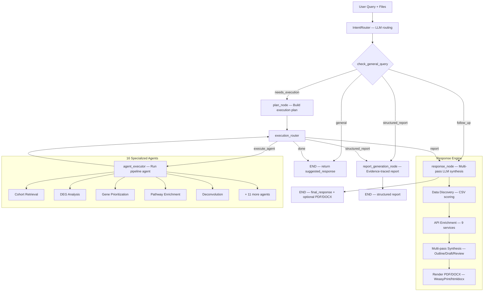

# Supervisor Agent — BiRAGAS

LangGraph-based multi-agent orchestrator for bioinformatics analysis pipelines. Routes natural-language queries to 16 specialized agents, manages conversation state across turns, executes dependency-aware pipelines with real-time progress streaming, and synthesizes results into chat responses or styled PDF/DOCX reports.

**Python:** >=3.10, <3.13 | **LLM:** AWS Bedrock (Claude) primary, OpenAI GPT-4o fallback | **Tests:** 633 across 30 test files

---

## Table of Contents

- [Architecture](#architecture)
- [Directory Structure](#directory-structure)
- [Quick Start](#quick-start)
- [Configuration](#configuration)
- [Available Agents (16)](#available-agents)
- [Pipeline Order & Dependencies](#pipeline-order--dependencies)
- [Execution Paths](#execution-paths)
- [LangGraph Workflow](#langgraph-workflow)
- [Response & Report Generation](#response--report-generation)
- [API Adapters (9 services)](#api-adapters)
- [File Type Detection](#file-type-detection)
- [Causality Module](#causality-module)
- [Reporting Engine](#reporting-engine)
- [Status Update System](#status-update-system)
- [Session & State Management](#session--state-management)
- [Testing](#testing)
- [Example Interactions](#example-interactions)
- [Adding a New Agent](#adding-a-new-agent)
- [Related Documentation](#related-documentation)

---

## Architecture



### Key Capabilities

- **Intent routing** — LLM-powered with keyword fallback, multi-agent pipeline detection
- **Dependency-aware execution** — automatically chains upstream agents when data is missing
- **Real-time streaming** — `AsyncGenerator[StatusUpdate]` with progress bars, agent step logs
- **Conversation persistence** — LangGraph checkpointer (MemorySaver dev, PostgreSQL prod)
- **Report generation** — evidence-traced structured reports, styled PDF/DOCX with 3 themes
- **API enrichment** — 9 external bioinformatics APIs queried in parallel
- **File type detection** — auto-classifies uploaded CSVs, FASTQs, JSON, 10X matrices into 13 types
- **LLM failover** — AWS Bedrock primary with automatic OpenAI fallback

---

## Directory Structure

```
supervisor_agent/
├── __init__.py                      # Exports: SupervisorAgent, SessionManager, ConversationState,
│                                    #          IntentRouter, RoutingDecision, AGENT_REGISTRY, AgentInfo
├── supervisor.py                    # Main orchestrator, file detection, chain builder, process_message()
├── state.py                         # ConversationState, SessionManager, Message, UploadedFile
├── router.py                        # IntentRouter (LLM), KeywordRouter (fallback), RoutingDecision
├── agent_registry.py                # 16 AgentInfo definitions, PIPELINE_ORDER, FILE_TYPE_TO_INPUT_KEY
├── llm_provider.py                  # llm_complete() — Bedrock/OpenAI unified async interface
├── logging_utils.py                 # SupervisorLogger with emoji indicators, analysis_id correlation
├── utils.py                         # File-type detection, output collection helpers
│
├── langgraph/                       # LangGraph workflow engine
│   ├── graph.py                     # build_supervisor_graph() — 6 nodes, conditional edges
│   ├── state.py                     # SupervisorGraphState TypedDict, SupervisorResult
│   ├── nodes.py                     # intent_node, plan_node, executor, response_node, report_node
│   ├── edges.py                     # check_general_query(), route_next()
│   ├── entry.py                     # run_supervisor_stream(), run_supervisor() — public API
│   └── checkpointer.py             # PostgresSaver (prod) / MemorySaver (dev)
│
├── executors/                       # Agent execution layer
│   ├── base.py                      # StatusType enum (9 values), StatusUpdate dataclass
│   └── pipeline_executors.py        # 15 async executor functions (one per agent)
│
├── response/                        # Response synthesis & rendering
│   ├── synthesizer.py               # 6 system prompts, synthesize_multipass(), synthesize_chat_multipass()
│   ├── data_discovery.py            # CSV discovery/scoring, query_csv_data(), column synonym resolution
│   ├── query_functions.py           # Regex dispatch: get_top_genes/pathways/drugs, regex_fast_path()
│   ├── document_renderer.py         # render_pdf() (WeasyPrint), render_docx() (htmldocx)
│   ├── style_engine.py              # 3 themes (default/clinical/minimal), LLM-generated CSS
│   └── enrichment_dispatcher.py     # Entity extraction + parallel API calls to 9 adapters
│
├── data_layer/                      # Structured data schemas
│   ├── schemas/
│   │   ├── manifest.py              # RunManifest, ModuleRun, ModuleStatus
│   │   ├── registry.py              # ArtifactEntry, ArtifactIndex
│   │   ├── evidence.py              # EvidenceCard, ConflictRecord, Confidence, NarrativeContext
│   │   └── sections.py              # SectionBlock, TableBlock, ReportingConfig, NarrativeMode
│   ├── adapters/                    # Module-specific artifact discovery (DEG, Pathway, Drug)
│   ├── manifest_builder.py          # LangGraph state -> RunManifest bridge
│   └── registry_builder.py          # RunManifest -> ArtifactIndex via module adapters
│
├── api_adapters/                    # External API integration layer
│   ├── base.py                      # BaseAPIAdapter — httpx, retry, cache, rate-limit
│   ├── config.py                    # APIConfig (Pydantic) — keys, rate limits, timeouts
│   ├── cache.py                     # TTLCache — LRU with per-entry expiry
│   ├── rate_limiter.py              # AsyncRateLimiter — semaphore + interval tracking
│   ├── chembl.py                    # ChEMBL drug/compound API
│   ├── dgidb.py                     # DGIdb gene-drug interactions (GraphQL)
│   ├── kegg.py                      # KEGG pathways (academic-gated)
│   ├── openfda.py                   # OpenFDA adverse events
│   ├── pubchem.py                   # PubChem compound properties
│   ├── reactome.py                  # Reactome pathway database
│   ├── string_ppi.py                # STRING protein-protein interactions
│   ├── ensembl.py                   # Ensembl gene annotations
│   └── clinical_trials.py           # ClinicalTrials.gov trial search
│
├── reporting_engine/                # Structured report generation
│   ├── planner.py                   # ReportPlanner — section selection from manifest
│   ├── evidence.py                  # score_findings(), detect_conflicts()
│   ├── validation.py                # ValidationGuard — pre-rendering checks
│   ├── enrichment.py                # ReportEnricher — optional API enrichment
│   ├── builders/                    # Section builders (DEG, Pathway, Drug, structural)
│   └── renderers/                   # Jinja2-based markdown renderer
│
├── causality/                       # Causal inference module
│   ├── core_agent.py                # CausalitySupervisorAgent — intent, gates, literature, DAG
│   ├── adapter.py                   # Async executor bridge to supervisor framework
│   ├── llm_bridge.py                # LLM access wrapper (Bedrock or fallback)
│   ├── tool_registry.py             # Slot-based tool dispatch table
│   ├── tool_wiring.py               # Wire tool slots at runtime
│   ├── intelligence.py              # Intent parsing, literature search, evidence fusion
│   ├── constants.py                 # LLM defaults, gate thresholds, evidence weights
│   └── ...                          # routing_rules, routing_fallbacks, dag_registry, file_mapper
│
├── tests/                           # 30 test files, 633 tests
│   ├── conftest.py                  # Shared fixtures (domain-free mock data)
│   ├── test_supervisor_agent.py     # Comprehensive test suite (253 tests)
│   └── ...                          # Per-module tests (adapters, edges, schemas, etc.)
│
└── requirements.txt                 # All dependencies with pinned versions
```

---

## Quick Start

### Prerequisites

- Python 3.10–3.12
- UV or pip for dependency management
- At least one LLM provider configured (OpenAI or AWS Bedrock)

### Installation

```bash
cd /home/wrahul/projects/agenticaib

# Install dependencies (using uv)
uv sync

# Or with pip
pip install -r agentic_ai_wf/supervisor_agent/requirements.txt
```

### Environment Setup

Copy the `.env` template and configure:

```bash
cp agentic_ai_wf/supervisor_agent/.env.example agentic_ai_wf/supervisor_agent/.env
```

Required variables (at minimum one LLM provider):

```bash
# LLM Provider — Option A: AWS Bedrock (primary)
USE_BEDROCK=true
AWS_ACCESS_KEY_ID=your_key
AWS_SECRET_ACCESS_KEY=your_secret
AWS_REGION=us-east-1
BEDROCK_MODEL_ID=us.anthropic.claude-opus-4-5-20251101-v1:0

# LLM Provider — Option B: OpenAI (fallback or standalone)
OPENAI_API_KEY=sk-...

# LangGraph
USE_LANGGRAPH_SUPERVISOR=true
CHECKPOINTER_BACKEND=memory            # "memory" for dev, "postgres" for prod
# CHECKPOINTER_DB_URL=postgresql://...  # required when backend=postgres
```

### Running the Streamlit App

```bash
cd /home/wrahul/projects/agenticaib
streamlit run agentic_ai_wf/streamlit_app/app.py
```

### Programmatic Usage (Streaming)

```python
import asyncio
from agentic_ai_wf.supervisor_agent.langgraph.entry import run_supervisor_stream

async def main():
    async for update in run_supervisor_stream(
        user_query="Find datasets for lupus disease",
        session_id="my-session-001",
        disease_name="lupus",
    ):
        print(f"[{update.status_type.value}] {update.title}: {update.message}")

asyncio.run(main())
```

### Programmatic Usage (Non-Streaming)

```python
from agentic_ai_wf.supervisor_agent.langgraph.entry import run_supervisor

result = asyncio.run(run_supervisor(
    user_query="Run DEG analysis for lupus",
    session_id="my-session-001",
    uploaded_files={"counts.csv": "/path/to/counts.csv"},
))
print(result.status)           # "completed"
print(result.final_response)   # Markdown response text
print(result.execution_time_ms)
```

### Legacy Path (SupervisorAgent class)

```python
from agentic_ai_wf.supervisor_agent import SupervisorAgent, SessionManager

supervisor = SupervisorAgent()
session = supervisor.session_manager.create_session()

async for update in supervisor.process_message(
    user_message="Find datasets for lupus",
    session_id=session.session_id,
):
    print(f"{update.status_type.value}: {update.message}")
```

---

## Configuration

### All Environment Variables

| Variable | Default | Description |
|----------|---------|-------------|
| `USE_BEDROCK` | `false` | Enable AWS Bedrock as primary LLM |
| `BEDROCK_MODEL_ID` | `us.anthropic.claude-opus-4-5-20251101-v1:0` | Bedrock model identifier |
| `AWS_ACCESS_KEY_ID` | — | AWS credentials |
| `AWS_SECRET_ACCESS_KEY` | — | AWS credentials |
| `AWS_REGION` | `us-east-1` | AWS region |
| `OPENAI_API_KEY` | — | OpenAI API key (fallback or primary) |
| `LLM_MAX_CONCURRENCY` | `10` | Max parallel LLM calls |
| `USE_LANGGRAPH_SUPERVISOR` | `false` | Enable LangGraph execution path |
| `CHECKPOINTER_BACKEND` | `memory` | `memory` (dev) or `postgres` (prod) |
| `CHECKPOINTER_DB_URL` | — | PostgreSQL connection string |
| `MAX_SESSIONS` | `1000` | Maximum concurrent sessions |
| `MAX_CONVERSATION_HISTORY` | `50` | Messages retained per session |
| `KEGG_ENABLED` | `false` | Enable KEGG API (academic use only) |
| `OPENFDA_API_KEY` | — | Optional — increases rate limit |
| `NCBI_API_KEY` | — | Optional NCBI API key |
| `DECONV_SC_BASE_DIR` | — | Path to single-cell reference files |

---

## Available Agents

| # | Agent | Display Name | Required Inputs | Produces | Est. Time |
|---|-------|-------------|-----------------|----------|-----------|
| 1 | `cohort_retrieval` | Cohort Retrieval | `disease_name` | `cohort_output_dir` | 2-10 min |
| 2 | `deg_analysis` | DEG Analysis | `counts_file`, `disease_name` | `deg_base_dir`, `deg_input_file` | 5-15 min |
| 3 | `gene_prioritization` | Gene Prioritization | `deg_input_file`, `disease_name` | `prioritized_genes_path` | 3-8 min |
| 4 | `pathway_enrichment` | Pathway Enrichment | `prioritized_genes_path`, `disease_name` | `pathway_consolidation_path` | 5-15 min |
| 5 | `deconvolution` | Deconvolution | `bulk_file`, `disease_name` | `deconvolution_output_dir` | 5-20 min |
| 6 | `temporal_analysis` | Temporal Analysis | time-course data, `disease_name` | `temporal_output_dir` | 5-15 min |
| 7 | `harmonization` | Harmonization | multi-study data | `harmonization_output_dir` | 10-30 min |
| 8 | `mdp_analysis` | MDP Analysis | counts/DEGs + disease_names[] | `mdp_output_dir` | 10-30 min |
| 9 | `perturbation_analysis` | Perturbation Analysis | `prioritized_genes_path` + pathway data | `perturbation_output_dir` | 5-15 min |
| 10 | `multiomics_integration` | Multi-Omics Integration | omics layer files | `multiomics_output_dir` | 10-30 min |
| 11 | `fastq_processing` | FASTQ Processing | `fastq_input_dir` | `counts_file` | 15-60 min |
| 12 | `molecular_report` | Molecular Report | prioritized genes + pathway data | PDF/DOCX report | 5-15 min |
| 13 | `crispr_perturb_seq` | CRISPR Perturb-seq | 10X directory (barcodes/features/matrix) | analysis results | 15-45 min |
| 14 | `crispr_screening` | CRISPR Screening | sgRNA count tables | MAGeCK/BAGEL2 results | 10-30 min |
| 15 | `crispr_targeted` | CRISPR Targeted | paired FASTQs + protospacer | indel quantification | 10-30 min |
| 16 | `causality` | Causality | pipeline outputs | causal evidence report | 5-15 min |

### Example Queries per Agent

```
Cohort Retrieval     "Find datasets for lupus disease"
DEG Analysis         "Run DEG analysis on my count data for breast cancer"
Gene Prioritization  "Prioritize the DEGs for lupus"
Pathway Enrichment   "What pathways are affected in lupus?"
Deconvolution        "Run cell type deconvolution on my data"
Temporal Analysis    "Analyze gene expression dynamics over time"
Harmonization        "Remove batch effects from my multi-study data"
MDP Analysis         "Compare pathways between Alzheimer's and Parkinson's"
Perturbation         "Find essential genes and drug targets for my disease"
Multi-Omics          "Integrate my genomics and transcriptomics data"
FASTQ Processing     "Process my FASTQ files"
Molecular Report     "Generate a molecular report with drug recommendations"
CRISPR Perturb-seq   "Run Perturb-seq analysis on my 10X CRISPR data"
CRISPR Screening     "Analyze my pooled CRISPR knockout screen"
CRISPR Targeted      "Quantify indels from my CRISPR amplicon sequencing"
Causality            "What are the causal mechanisms linking DEGs to pathways?"
```

---

## Pipeline Order & Dependencies

### Standard Pipeline

```
COHORT_RETRIEVAL -> DEG_ANALYSIS -> GENE_PRIORITIZATION -> PATHWAY_ENRICHMENT -> PERTURBATION_ANALYSIS -> MOLECULAR_REPORT
```

The supervisor automatically builds the minimal chain needed. For example, if a user asks for "pathway enrichment" but only has raw counts, the system chains: DEG -> Gene Prioritization -> Pathway Enrichment, skipping cohort retrieval.

### Standalone Agents (no pipeline dependencies)

Deconvolution, Temporal Analysis, Harmonization, MDP Analysis, Multi-Omics Integration, FASTQ Processing, CRISPR Perturb-seq, CRISPR Screening, CRISPR Targeted, Causality

### File Type to Input Key Mapping

When a file is uploaded, its type is auto-detected and mapped to agent input keys:

| Detected Type | Mapped Input(s) |
|---------------|-----------------|
| `raw_counts` | `counts_file`, `bulk_file` |
| `deg_results` | `deg_input_file` |
| `prioritized_genes` | `prioritized_genes_path` |
| `pathway_results` | `pathway_consolidation_path` |
| `multiomics_layer` | accumulated into `multiomics_layers` dict |
| `patient_info` | `patient_info_path` |
| `deconvolution_results` | `xcell_path` |
| `crispr_10x_data` | `crispr_10x_input_dir` |
| `crispr_count_table` | `crispr_screening_input_dir` |

---

## Execution Paths

The supervisor has two execution paths, controlled by `USE_LANGGRAPH_SUPERVISOR`:

### LangGraph Path (recommended)

```
run_supervisor_stream() / run_supervisor()
  -> build_supervisor_graph() (StateGraph with 6 nodes)
  -> intent_node -> plan_node -> [executor_node <-> router loop] -> response_node
  -> Checkpointed conversation history (PostgreSQL or MemorySaver)
```

### Legacy Path

```
SupervisorAgent.process_message()
  -> IntentRouter.route()
  -> _build_execution_chain()
  -> Execute agents via _agent_executors dict
  -> Format completion message
```

Both paths yield `StatusUpdate` objects for real-time UI feedback.

---

## LangGraph Workflow

### Graph Topology

| Node | Purpose |
|------|---------|
| `intent_node` | Route query, detect file types, extract params, determine response format |
| `plan_node` | Build execution plan, skip agents with existing outputs |
| `execution_router` | Route to next agent or exit |
| `agent_executor` | Run current agent, update workflow_outputs, handle retries |
| `response_node` | LLM synthesis: data discovery -> API enrichment -> multi-pass synthesis -> render |
| `report_generation_node` | Evidence-traced structured report: manifest -> artifacts -> plan -> build -> validate -> render |

### Conditional Edges

**After intent_node (`check_general_query`):**
- General query with no response needed -> END
- General/follow-up with response needed -> response_node
- Structured report request with existing results -> report_generation_node
- Agent-specific query -> plan_node

**After executor (`route_next`):**
- More agents in plan -> executor (loop)
- All done + structured report requested -> report_generation_node
- All done + needs response -> response_node
- All done -> END

### Conversation Persistence

Thread ID = `session_id`. Checkpointer preserves `conversation_history` across invocations (max 50 messages). Per-turn fields (response_format, final_response, etc.) are explicitly reset to prevent checkpoint leakage.

---

## Response & Report Generation

### Multi-Pass Synthesis

| Mode | Passes | Use Case |
|------|--------|----------|
| Chat (`synthesize_chat_multipass`) | 2 (Analysis -> Refinement) | Interactive responses |
| Document (`synthesize_multipass`) | 3-4 (Outline -> Draft -> Review -> Polish) | PDF/DOCX reports |
| Narrative (`augment_narrative`) | 1 | Structured report section augmentation |

### Document Themes

| Theme | Primary Color | Font |
|-------|--------------|------|
| `default` | Teal `#028090` | Segoe UI / system sans-serif |
| `clinical` | Navy `#1a365d` | Georgia / serif |
| `minimal` | Gray `#333333` | Helvetica Neue / sans-serif |

Users can also provide freeform styling instructions (e.g., "make headings red") — the style engine generates CSS via an LLM call.

### Rendering

- **PDF:** WeasyPrint (Markdown -> HTML -> PDF). Auto-detects landscape for wide tables (>7 columns).
- **DOCX:** htmldocx with post-processing: proportional column widths, header row repeat, font styling.

---

## API Adapters

Nine external bioinformatics services are queried in parallel for response enrichment:

| Service | Rate Limit | Key Methods | Data Returned |
|---------|-----------|-------------|---------------|
| **Ensembl** | 15 req/s | `lookup_symbol()` | Gene annotations, biotype, location |
| **STRING** | 4 req/s | PPI network | Protein-protein interaction edges |
| **DGIdb** | 5 req/s | GraphQL batch | Gene-drug interactions |
| **ChEMBL** | 5 req/s | `search_molecule()` | Drug mechanisms, indications |
| **OpenFDA** | 4 req/s | Adverse events | Drug safety data |
| **PubChem** | 5 req/s | `get_compound_by_name()` | MW, LogP, TPSA, formula |
| **Reactome** | 3 req/s | `get_pathway()` | Pathway details |
| **KEGG** | 2 req/s | `get_pathway()` | Pathway info (academic-gated) |
| **ClinicalTrials.gov** | 3 req/s | `search_studies()` | Recruiting trials |

All adapters share:
- `BaseAPIAdapter` with httpx client, retry (exponential backoff), TTL cache (1h default, 2048 entries max), rate limiting
- Auto-registration via `__init_subclass__` into `API_ADAPTER_REGISTRY`

---

## File Type Detection

The supervisor auto-classifies uploaded files in priority order:

| Priority | Type | Detection Method |
|----------|------|------------------|
| 1 | `fastq_file` | `.fastq`, `.fq`, `.fastq.gz`, `.fq.gz` extensions |
| 2 | `crispr_10x_data` | barcodes.tsv + features.tsv + matrix.mtx |
| 3 | `multiomics_layer` | Filename contains: genomics, transcriptomics, epigenomics, proteomics, metabolomics |
| 4 | `json_data` | `.json` extension |
| 5 | `gene_list` | `.txt` with short alphanumeric lines |
| 6 | `crispr_count_table` | CSV with sgRNA/guide_rna columns |
| 7 | `pathway_results` | CSV with >=2 pathway indicator columns |
| 8 | `prioritized_genes` | CSV with composite_score / druggability_score |
| 9 | `deconvolution_results` | Filename contains cibersort/xcell/deconv |
| 10 | `patient_info` | Filename contains patient or >=2 clinical columns |
| 11 | `raw_counts` | Gene ID column + all numeric columns, no DEG terms |
| 12 | `deg_results` | Both fold-change AND p-value columns |
| 13 | `unknown` | Could not determine |

---

## Causality Module

Causal inference engine with 7 intent types, eligibility gates, literature-informed evidence fusion, and DAG construction.

### Intent Types

| ID | Intent | Description |
|----|--------|-------------|
| I_01 | Causal Drivers | Find causal drivers of a phenotype |
| I_02 | Directed Causality | Test X -> Y causal relationship |
| I_03 | Intervention | Identify actionable interventions |
| I_04 | Comparative | Compare causal mechanisms across conditions |
| I_05 | Counterfactual | What-if analysis |
| I_06 | Evidence Inspection | Explain existing evidence |
| I_07 | Association | Standard association analysis |

### Evidence Weights (6-stream fusion)

| Stream | Weight |
|--------|--------|
| Genetic | 0.30 |
| Perturbation | 0.25 |
| Temporal | 0.20 |
| Network | 0.15 |
| Expression | 0.05 |
| Immunological | 0.05 |

### Eligibility Gates

| Gate | Threshold | Outcome |
|------|-----------|---------|
| Min samples | < 30 | BLOCK |
| Warn samples | < 60 | WARN |
| Min MR instruments | < 3 | BLOCK |
| Edge confidence | < 0.70 | WARN |

---

## Reporting Engine

Generates structured, evidence-traced reports from pipeline outputs.

### Pipeline

```
workflow_outputs -> manifest_from_state() -> RunManifest
  -> build_artifact_index() -> ArtifactIndex
    -> ReportPlanner.plan() -> List[SectionBlock]
      -> Builders populate sections from artifacts
        -> score_findings() + detect_conflicts()
          -> ValidationGuard.validate()
            -> render_markdown() -> optional render_pdf/docx()
```

### Report Sections (10)

| Order | Section | Required Module |
|-------|---------|-----------------|
| 0 | Executive Summary | Always |
| 1 | Run Summary | Always |
| 2 | Data Overview | Always |
| 3 | Differential Expression Analysis | deg_analysis |
| 4 | Pathway Enrichment Analysis | pathway_enrichment |
| 5 | Drug Discovery & Perturbation | perturbation_analysis |
| 6 | Integrated Findings | Always |
| 7 | Limitations & Caveats | Always |
| 8 | Recommended Next Steps | Always |
| 9 | Appendix | Always (toggleable) |

### Evidence System

- **Confidence tiers:** HIGH, MEDIUM, LOW, FLAGGED
- **Conflict detection:** Cross-module directional disagreements (e.g., gene up in DEG, down in pathway context)
- **Validation:** Section IDs, table column counts, artifact references checked before rendering

---

## Status Update System

All agent executors stream `StatusUpdate` objects for real-time UI feedback:

| Type | Icon | Color | Description |
|------|------|-------|-------------|
| `THINKING` | 🧠 | Yellow | Analyzing/understanding query |
| `ROUTING` | 🔍 | Blue | Determining agent(s) to use |
| `VALIDATING` | 📋 | Blue | Checking input requirements |
| `EXECUTING` | ⚡ | Green | Running the agent |
| `PROGRESS` | 🔄 | Green | Mid-execution progress update |
| `INFO` | ℹ️ | Blue | Informational message |
| `COMPLETED` | ✅ | Green | Agent/pipeline finished successfully |
| `ERROR` | ❌ | Red | Execution failure |
| `WAITING_INPUT` | 📎 | Purple | Need additional user input |

### StatusUpdate Fields

```python
StatusUpdate(
    status_type: StatusType,           # Enum value above
    title: str,                        # Short header for UI
    message: str,                      # Markdown body
    details: Optional[str],            # Collapsible detail text
    progress: Optional[float],         # 0.0 to 1.0
    agent_name: Optional[str],         # e.g., "deg_analysis"
    timestamp: float,                  # Unix timestamp
    generated_files: Optional[List],   # File paths (on completion)
    output_dir: Optional[str],         # Agent output directory
)
```

---

## Session & State Management

### ConversationState

Tracks the complete state of a user session:

| Field | Type | Purpose |
|-------|------|---------|
| `session_id` | UUID | Unique session identifier |
| `messages` | List[Message] | Conversation history |
| `uploaded_files` | Dict[str, UploadedFile] | File registry |
| `agent_executions` | List[AgentExecution] | Execution history |
| `workflow_state` | Dict[str, Any] | Agent outputs — chained between agents |
| `current_disease` | str | Active disease context |
| `waiting_for_input` | bool | Awaiting user input |
| `pending_agent_type` | str | Agent waiting to resume |

### Workflow State Chaining

Agent outputs accumulate in `workflow_state` and become available as inputs to subsequent agents:

```
DEG agent completes -> workflow_state["deg_base_dir"] = "/out/deg"
Gene Prio starts   -> inputs["deg_base_dir"] from workflow_state
Gene Prio completes -> workflow_state["prioritized_genes_path"] = "/out/gp/genes.csv"
Pathway starts     -> inputs["prioritized_genes_path"] from workflow_state
```

### SessionManager

In-memory session store with LRU eviction (production: replace with Redis/DB). Max sessions controlled by `MAX_SESSIONS` env var. Supports user-based session lookup and automatic cleanup of stale sessions.

---

## Testing

### Running Tests

```bash
cd /home/wrahul/projects/agenticaib/agentic_ai_wf/supervisor_agent

# Run all tests
PYTHONPATH=/home/wrahul/projects/agenticaib/agentic_ai_wf \
  python -m pytest tests/ -v -p no:zarr

# Run the comprehensive test suite only
PYTHONPATH=/home/wrahul/projects/agenticaib/agentic_ai_wf \
  python -m pytest tests/test_supervisor_agent.py -v -p no:zarr

# Run specific test class
PYTHONPATH=/home/wrahul/projects/agenticaib/agentic_ai_wf \
  python -m pytest tests/test_supervisor_agent.py::TestFileTypeDetection -v -p no:zarr
```

### Test Coverage (633 tests across 30 files)

| Area | Test Files | Tests |
|------|-----------|-------|
| Core (state, registry, routing, chain building, file detection) | `test_supervisor_agent.py` | 253 |
| API Adapters | `test_cache.py`, `test_rate_limiter.py`, `test_base_api_adapter.py`, `test_api_config.py`, 9 service-specific | ~70 |
| Response & Synthesis | `test_multipass.py`, `test_css_regeneration.py`, `test_enrichment_dispatcher.py`, `test_dynamic_enrichment.py` | ~160 |
| Reporting Engine | `test_schemas.py`, `test_planner.py`, `test_section_builders.py`, `test_evidence_validation.py`, `test_builders_data.py`, `test_renderer.py` | ~100 |
| LangGraph | `test_edges.py`, `test_format_carryforward.py`, `test_integration.py`, `test_report_viewer.py` | ~50 |

All tests run without LLM calls or network access (fully mocked).

---

## Example Interactions

### Single Agent — Dataset Search

```
User: "Find datasets for lupus disease in blood"

🧠 Understanding Your Request
🔍 Analyzing Intent → Routing to 🔍 Cohort Retrieval Agent (95% confidence)
📋 Checking Requirements → disease_name: lupus ✅, tissue_filter: blood ✅
🚀 Starting Cohort Retrieval Agent
🔄 Searching GEO Database...
🔄 Searching ArrayExpress...
✅ Cohort Retrieval Complete! Found 15 datasets.
```

### Multi-Agent Pipeline

```
User: "Complete analysis from datasets to pathways for breast cancer"

🔍 Multi-Agent Pipeline Detected: 4 agents
   🔍 Cohort Retrieval → 📊 DEG Analysis → 🎯 Gene Prioritization → 🛤️ Pathway Enrichment

📍 Agent 1/4: 🔍 Cohort Retrieval → ✅ Complete
📍 Agent 2/4: 📊 DEG Analysis → ✅ Complete (2,847 DEGs)
📍 Agent 3/4: 🎯 Gene Prioritization → ✅ Complete
📍 Agent 4/4: 🛤️ Pathway Enrichment → ✅ Complete

🎉 Pipeline Complete! 4/4 agents succeeded.
```

### Missing Inputs

```
User: "Run pathway analysis"

🎯 Routing to 🛤️ Pathway Enrichment Agent (90% confidence)
📎 Additional Input Needed:
   📎 prioritized_genes_path — CSV file with prioritized genes
      Example: lupus_DEGs_prioritized.csv
   ✏️ disease_name — Disease name for scoring
      Example: lupus
```

---

## Adding a New Agent

### Step 1: Define the agent in `agent_registry.py`

```python
# Add to AgentType enum
class AgentType(str, Enum):
    ...
    NEW_AGENT = "new_agent"

# Define the agent
NEW_AGENT_DEF = AgentInfo(
    agent_type=AgentType.NEW_AGENT,
    name="new_agent",
    display_name="🆕 New Agent",
    description="What this agent does",
    detailed_description="Detailed explanation...",
    required_inputs=[
        InputRequirement(name="input_file", description="Input data", is_file=True, file_type="csv"),
        InputRequirement(name="disease_name", description="Disease", is_file=False),
    ],
    outputs=[OutputSpec(name="output_dir", description="Results", state_key="new_agent_output_dir")],
    keywords=["keyword1", "keyword2", "keyword3"],
    example_queries=["Example query 1", "Example query 2"],
    estimated_time="5-10 minutes",
    depends_on=[],                       # AgentType dependencies
    produces=["new_agent_output_dir"],   # Keys added to workflow_state
    requires_one_of=["input_file"],      # At least one must be available
)

# Register
AGENT_REGISTRY[AgentType.NEW_AGENT] = NEW_AGENT_DEF
```

### Step 2: Write the executor in `executors/pipeline_executors.py`

```python
async def execute_new_agent(
    agent_info: AgentInfo,
    inputs: Dict[str, Any],
    state: ConversationState,
) -> AsyncGenerator[StatusUpdate, None]:
    yield StatusUpdate(StatusType.EXECUTING, "Starting New Agent", "Processing...")

    output_dir = _get_output_dir("new_agent", state.session_id)
    # ... call your analysis function ...

    state.workflow_state["new_agent_output_dir"] = str(output_dir)
    generated_files = _collect_files(str(output_dir))
    yield StatusUpdate(StatusType.COMPLETED, "New Agent Complete!", "Results ready.",
                       generated_files=generated_files, output_dir=str(output_dir))
```

### Step 3: Register the executor

In `supervisor.py` `_register_agent_executors()`:

```python
from .executors.pipeline_executors import execute_new_agent
# Add to the return dict:
AgentType.NEW_AGENT: execute_new_agent,
```

And in `langgraph/nodes.py` `EXECUTOR_MAP`:

```python
AgentType.NEW_AGENT: execute_new_agent,
```

### Step 4: Update routing prompt (optional)

Add the new agent to `ROUTING_SYSTEM_PROMPT` in `router.py` with dependency order, examples, and guidelines.

---

## Related Documentation

| Document | Purpose |
|----------|---------|
| `SUPERVISOR_AGENT_ARCHITECTURE.md` | Deep technical reference — every module, class, method, data flow |
| `SUPERVISOR_AGENT_INTEGRATION_GUIDE.md` | Integration guide for deploying with Django + FastAPI + Celery on EC2 |
| `STREAMLIT_UI_REFERENCE_GUIDE.md` | Complete UI component reference for Next.js/React migration |
| `PRODUCTION_READINESS_AUDIT.md` | Production readiness assessment |
| `INTEGRATION_GUIDE.md` | Additional integration notes |
| `requirements.txt` | All Python dependencies with pinned versions |
| `tests/test_supervisor_agent.py` | Comprehensive test suite (253 tests covering 25 modules) |
